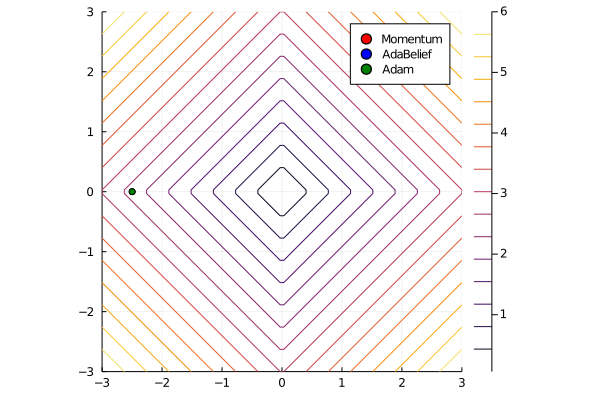
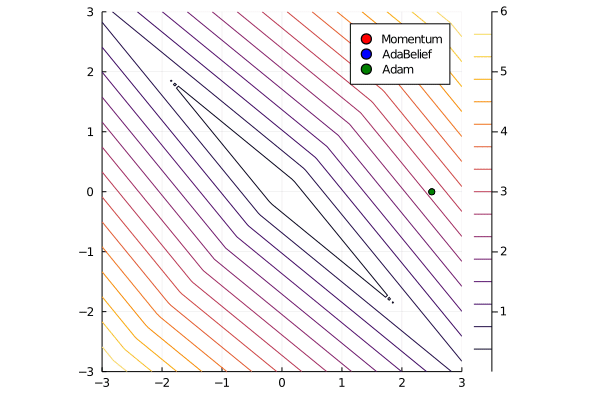
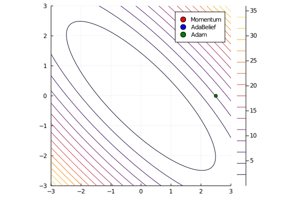
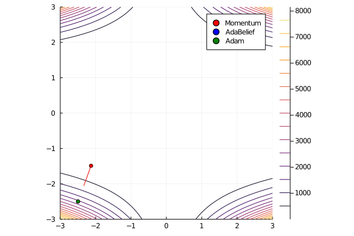
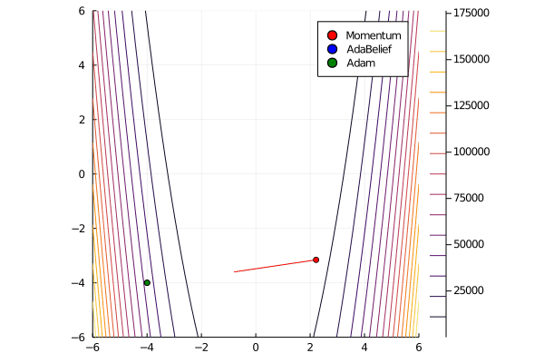

# AdaBelief for toy problems by Julia
## What's this repository
Visualizing [AdaBelief](https://juntang-zhuang.github.io/adabelief/) optimizer with toy problems.

## Mimicking the figures in the paper
### Overview
Though figures did not reproduce exactly same results,
they show AdaBelief defeated Adam and SGD.

NOTE: need to adjust iteration numbers.

### Fig.3(a)

### Fig.3(b)

### Fig.3(c)
seems pretty good.

### Fig.3(d)
TBD

### Fig.3(e)
We referred to these definitions for Beale function.
- http://www-optima.amp.i.kyoto-u.ac.jp/member/student/hedar/Hedar_files/TestGO_files/Page288.htm
- http://benchmarkfcns.xyz/benchmarkfcns/bealefcn.html

3D-visualization of Fig.3(f) in the paper seems to differ.

### Fig.3(g)
Do I set wrong learning rate...?
